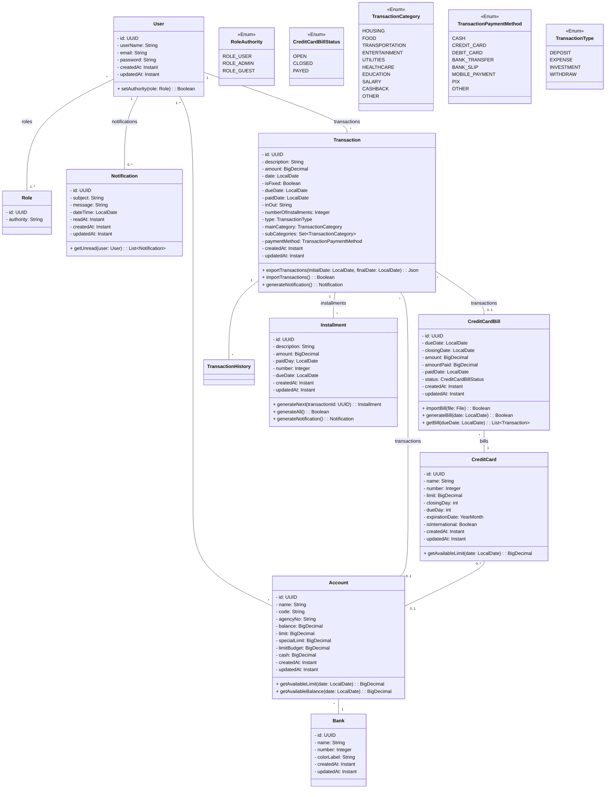

# Expense Tracker

Sistema de controle financeiro pessoal com suporte a transações, cartões de crédito, contas bancárias e notificações.

## Diagrama de Classes

## Entidades

| Entidade             | Descrição                                                     |
| -------------------- | ------------------------------------------------------------- |
| `User`               | Usuário do sistema com controle de papéis e notificações      |
| `Role`               | Papel/permissão associado ao usuário                          |
| `Notification`       | Notificações geradas por transações e parcelas                |
| `Transaction`        | Transação financeira (despesa, receita, investimento)         |
| `Installment`        | Parcelas vinculadas a uma transação                           |
| `Account`            | Conta bancária com saldos e limites                           |
| `Bank`               | Banco associado a contas e cartões                            |
| `CreditCard`         | Cartão de crédito com limite e datas de fechamento/vencimento |
| `CreditCardBill`     | Fatura do cartão de crédito                                   |
| `TransactionHistory` | Histórico de alterações de uma transação _(a implementar)_    |

## Enumerações

| Enum                       | Valores                                                                                                                     |
| -------------------------- | --------------------------------------------------------------------------------------------------------------------------- |
| `TransactionType`          | `DEPOSIT`, `EXPENSE`, `INVESTMENT`, `WITHDRAW`                                                                              |
| `TransactionCategory`      | `HOUSING`, `FOOD`, `TRANSPORTATION`, `ENTERTAINMENT`, `UTILITIES`, `HEALTHCARE`, `EDUCATION`, `SALARY`, `CASHBACK`, `OTHER` |
| `TransactionPaymentMethod` | `CASH`, `CREDIT_CARD`, `DEBIT_CARD`, `BANK_TRANSFER`, `BANK_SLIP`, `MOBILE_PAYMENT`, `PIX`, `OTHER`                         |
| `CreditCardBillStatus`     | `OPEN`, `CLOSED`, `PAYED`                                                                                                   |
| `RoleAuthority`            | `ROLE_USER`, `ROLE_ADMIN`, `ROLE_GUEST`                                                                                     |
